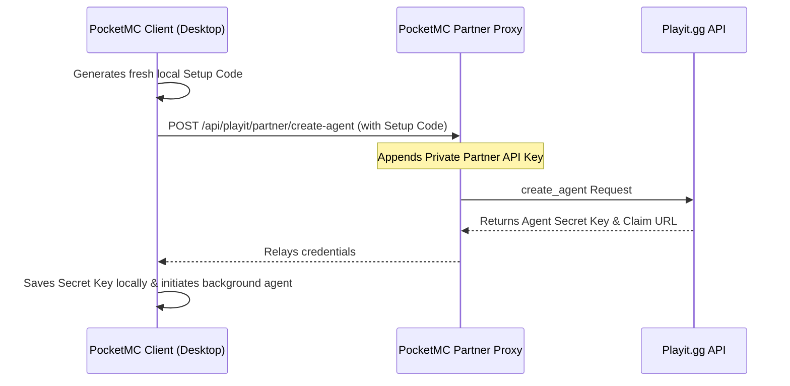

# PocketMC Playit.gg Tunnel Integration

PocketMC features a first-class, built-in integration with **Playit.gg**, allowing server owners to expose their Minecraft Java and Bedrock servers to the public internet securely without requiring manual port-forwarding, dynamic DNS setup, or sharing private IP addresses.

---

## Features
- **Zero Configuration:** Instantly provision public TCP/UDP endpoints from the user interface.
- **Managed Lifecycle:** PocketMC automatically downloads, validates, launches, monitors, and stops the local Playit.gg client agent in the background alongside your Minecraft instances.
- **Port Matching & Discovery:** Discovers and binds existing tunnels or automatically registers fresh ones matching your Java (`25565`) or Bedrock (`19132`) listener ports.
- **Real-Time Diagnostics:** The dashboard monitors the agent state and displays public numerical and custom domain addresses as clickable cards.
- **Unclaimed Account Routing:** Generates and presents claims URLs dynamically to link provisioned agents safely to a personal Playit profile.
- **Automatic Agent ID Recovery:** The provisioning flow automatically discovers and recovers the agent ID — no manual input required.
- **HTTPS Tunnel for Remote Control:** PocketMC can expose the Remote Control web dashboard over the internet via a Playit.gg HTTPS tunnel, alongside the existing TCP/UDP game tunnels. **Requires a Playit.gg Premium subscription.**
- **Playit Servers Status Page:** A dedicated in-app view shows the live status of Playit's regional relay servers.
- **Manage Agent Button:** One-click access on the Tunnel page to open the Playit agent management panel directly from the app.

---

## Architecture & Provisioning Flow

PocketMC communicates with the Playit.gg API using a secure, stateless partner token proxy to provision and claims agents without compromising partner API keys:

Once provisioned, the client runs `playit.exe` using standard input/output redirection. The output stream is parsed dynamically to extract domain bindings and verify connectivity. The agent ID is recovered automatically from the Playit API response, so no manual agent ID is required during provisioning.

---

## Configuration & Usage

### Linking your Playit Account
1. Navigate to **Tunnels** on the sidebar or click **Link Playit.gg** in the dashboard.
2. If an agent has never been configured, PocketMC will generate an activation code and present a **Claim URL**.
3. Click the claim link to open your browser, log in to Playit.gg, and associate the agent with your account.
4. PocketMC will detect the claim, save your persistent agent secret key, and start the background service.

### Exposing Server Ports
When starting a Minecraft server instance:
- PocketMC checks if a tunnel matching the server's local port exists on your Playit agent.
- If it does, the tunnel is used and the public address is shown on the server's dashboard card.
- If it does not, PocketMC calls the Playit API to request a matching tunnel (TCP for Java, UDP for Bedrock).

---

## Troubleshooting Common Errors

### 1. "Agent Offline" or Connection Failures
* **Cause:** The background `playit.exe` process was killed, or local firewall/antivirus is blocking the connection to Playit's regional servers.
* **Solution:** Navigate to **Settings ➔ Diagnostics** and run a **Health Check**. Ensure `playit.exe` is whitelisted in Windows Defender Firewall.

### 2. "Account Over Limit"
* **Cause:** Playit.gg free tier accounts are limited to a maximum of 4 active tunnels or a limited number of agents.
* **Solution:** Log in to the [Playit Console](https://playit.gg/) in your browser, check your active agents and tunnels, and delete any unused ones to free up space.

### 3. "Unclaimed Agent"
* **Cause:** An agent was provisioned on your PC but was never successfully linked to a registered Playit account.
* **Solution:** Restart the tunnel flow in PocketMC, copy the claim link, and complete the activation process in your web browser.

### 4. Remote Control HTTPS Tunnel Not Working
* **Cause:** The Playit HTTPS tunnel for Remote Control requires your Playit agent to be online and claimed. If the agent is offline or unclaimed, the HTTPS tunnel cannot be established.
* **Note:** HTTPS tunnels are a **Playit.gg Premium** feature. Ensure your account has an active Premium subscription before enabling this option.
* **Solution:** Ensure the Playit agent is connected (green status on the Tunnel page) and your account is claimed. Then re-enable the Remote Control HTTPS tunnel from **Settings → Remote Control**.
